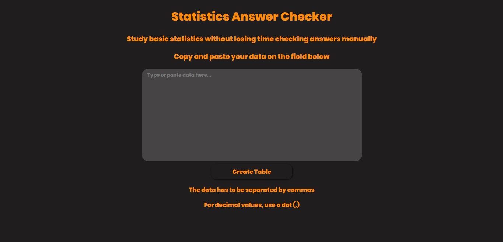
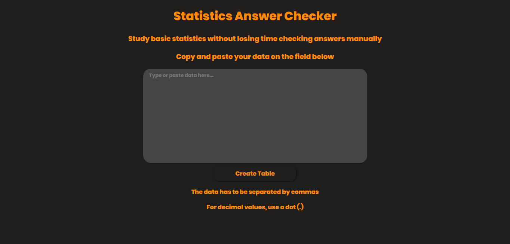

# Statistics Answer Checker

> Este é um projeto para ajudá-lo a verificar suas respostas para exercícios de estatística.

Este aplicativo web foi desenvolvido pensando em como pode ser chato verificar todas as respostas
de um exercício de estatística, tendo que revisar manualmente todos os cálculos, o que não pode
apenas tornar as coisas mais difíceis e passivas de erros, mas faz a disciplina de estatística parecer um monstro.
Com esta aplicação, você pode verificar facilmente todas as informações relevantes sobre os
dados do exercício, simplesmente passando-os para o aplicativo. De uma tabela simples
de frequências absolutas de cada dado individual a uma tabela completa de frequências de intervalos absolutas e relativas, 
você terá todas as informações necessárias para checar seus exercícios.

### Linguagens
Leia este arquivo em sua linguagem preferida:
- [English](README.md)
- [Português](README.pt.md)

### Principais tecnologias utilizadas

- React
    - React Router
- Typescript
- NPM packages
    - Papaparser

## Sumário

- [Instalação](#instalação)
- [Como usar](#como-usar)
- [Licença](#licença)
- [Sobre](#sobre)

### Instalação
Para instalar este projeto em sua máquina local, siga as etapas abaixo.

0. Primeiro, verifique se o NodeJS está instalado no seu computador.
1. Clone este repositório.
1. Abra o terminal na pasta do repositório clonado e execute `npm install` ou se você é um usuário do `yarn`, execute `yarn add` para instalar todas as dependências do projeto.
1. Quando a instalação terminar, execute `npm start` ou `yarn start` para iniciar o servidor de desenvolvimento.

### Como usar

Para usar este aplicativo na web, acesse este [link](https://gabrielmcavalcante.github.io/statistics-answer-checker/) e siga as etapas do gif abaixo.

[Voltar ao topo](#statistics-answer-checker) 
[Voltar ao sumário](#sumário)

### Licença

MIT License

Copyright (c) 2020 GabrielMCavalcante

Permission is hereby granted, free of charge, to any person obtaining a copy
of this software and associated documentation files (the "Software"), to deal
in the Software without restriction, including without limitation the rights
to use, copy, modify, merge, publish, distribute, sublicense, and/or sell
copies of the Software, and to permit persons to whom the Software is
furnished to do so, subject to the following conditions:

The above copyright notice and this permission notice shall be included in all
copies or substantial portions of the Software.

THE SOFTWARE IS PROVIDED "AS IS", WITHOUT WARRANTY OF ANY KIND, EXPRESS OR
IMPLIED, INCLUDING BUT NOT LIMITED TO THE WARRANTIES OF MERCHANTABILITY,
FITNESS FOR A PARTICULAR PURPOSE AND NONINFRINGEMENT. IN NO EVENT SHALL THE
AUTHORS OR COPYRIGHT HOLDERS BE LIABLE FOR ANY CLAIM, DAMAGES OR OTHER
LIABILITY, WHETHER IN AN ACTION OF CONTRACT, TORT OR OTHERWISE, ARISING FROM,
OUT OF OR IN CONNECTION WITH THE SOFTWARE OR THE USE OR OTHER DEALINGS IN THE
SOFTWARE.

[Voltar ao topo](#statistics-answer-checker) 
[Voltar ao sumário](#sumario)

### Sobre

- Github - [GabrielMCavalcante](https://github.com/GabrielMCavalcante)

- LinkedIn - [Gabriel Cavalcante](https://linkedin.com/in/gabrielmcavalcante)

[Voltar ao topo](#statistics-answer-checker) 
[Voltar ao sumário](#sumário)
